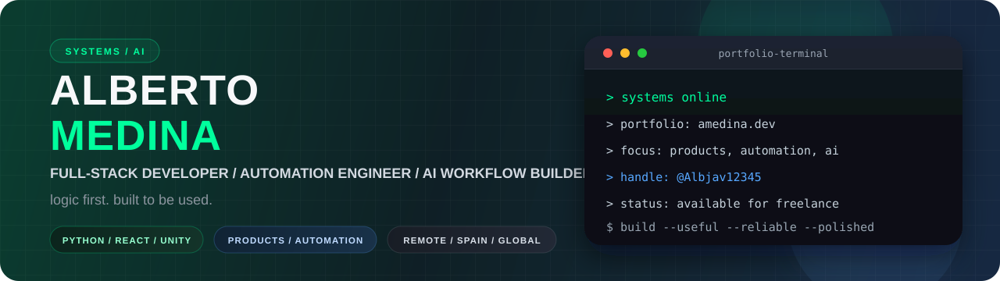
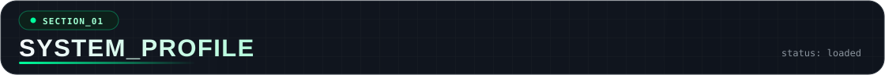
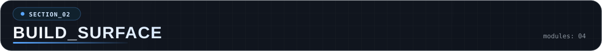
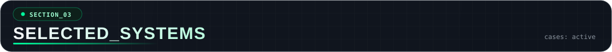
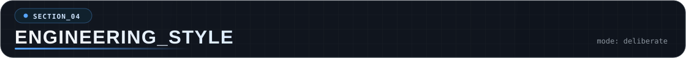
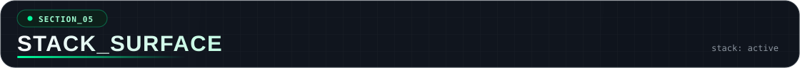
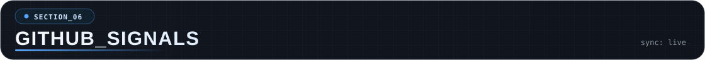
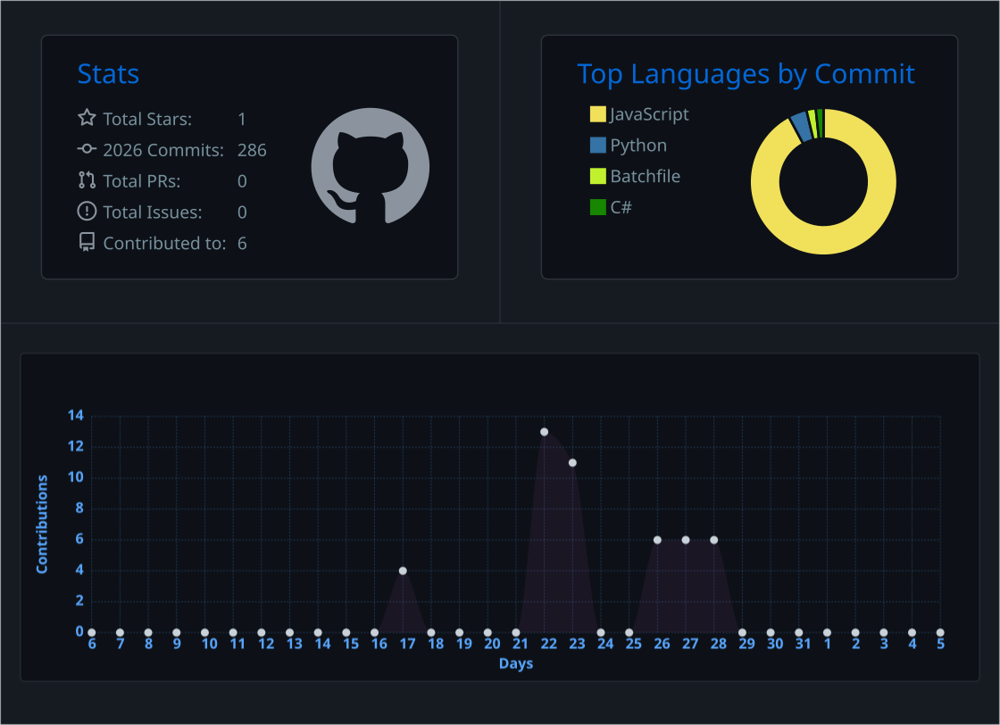
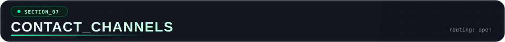

  <picture>
    <source media="(max-width: 640px)" srcset="./assets/profile-header-mobile.svg" />
    
  </picture>

  
  
  
  

  <code>FULL-STACK PRODUCTS / AUTOMATION / AI SYSTEMS</code>

  I build products and workflows that solve real operational problems, reduce friction, and still feel intentional to use.

  Open to freelance collaborations, technical partnerships, and early-career software opportunities.

  <picture>
    <source media="(max-width: 640px)" srcset="./assets/section-system-profile-mobile.svg" />
    
  </picture>

> `origin` Unity + C#  
> `current` full-stack development / automation / AI-assisted tooling  
> `approach` logic first, built to be used  
> `priority` useful systems, polished interaction, reliable execution

I started building in Unity and C#, which taught me to care about how systems feel in the hands of the user, not just how they work under the hood.

That same mindset now drives my work in full-stack development, automation, and AI-assisted tooling. I like building systems that are useful in the real world, understandable as they grow, and polished enough that people actually want to use them.

  <picture>
    <source media="(max-width: 640px)" srcset="./assets/section-build-surface-mobile.svg" />
    
  </picture>

- `full-stack products` React, Vite, Node.js, Python, and modern backend integrations
- `automation systems` repetitive workflows, internal tooling, and operational pipelines
- `AI-assisted tooling` APIs, OCR, classification, and human approval loops
- `interactive systems` polished web interfaces, product-style UX, and custom Unity tooling

  <picture>
    <source media="(max-width: 640px)" srcset="./assets/section-selected-systems-mobile.svg" />
    
  </picture>

**[amedina.dev](https://amedina.dev)** / [source](https://github.com/Albjav12345/amedina-dev)  
`portfolio / frontend architecture / interaction design`  
Personal portfolio with a live terminal, custom interactions, and project pages designed to present my work clearly and professionally.

**[Fortnite Lobby Stream Finder](https://github.com/Albjav12345/Fortnite-Lobby-Stream-Finder)**  
`python / OCR / automation / API checks`  
Workflow that combines image processing, OCR, Twitch API checks, and live monitoring to detect streamers in real time.

**[FlappyBird-Unity](https://github.com/Albjav12345/FlappyBird-Unity)**  
`unity / firebase / gameplay systems`  
Compact Unity build that mixes gameplay, API usage, Firebase integration, and persistence in a way that shows practical engineering beyond a basic clone.

**[Portfolio Case Studies](https://amedina.dev)**  
`ai inbox triage / booking systems / custom unity interfaces`  
Some of the work I want to be hired for is presented as case-study context in my portfolio rather than as a public repository.

  <picture>
    <source media="(max-width: 640px)" srcset="./assets/section-engineering-style-mobile.svg" />
    
  </picture>

> build for real use  
> keep humans in control, especially in AI workflows  
> reduce friction without hiding complexity  
> prefer polished, understandable systems over flashy throwaways

  <picture>
    <source media="(max-width: 640px)" srcset="./assets/section-stack-surface-mobile.svg" />
    
  </picture>

> `languages` Python / C# / JavaScript / TypeScript / SQL  
> `frontend` React / Vite / Tailwind CSS / motion-driven UI  
> `backend` Node.js / Flask / Firebase / Supabase / API integrations  
> `automation` Selenium / OCR pipelines / workflow automation / LLM tooling  
> `interactive` Unity / custom tooling / gameplay systems / interface prototyping

  <picture>
    <source media="(max-width: 640px)" srcset="./assets/section-github-signals-mobile.svg" />
    
  </picture>

  <code>public_surface</code> GitHub repositories + portfolio case studies 
  <code>focus_axes</code> products / automation / AI systems 
  <code>signal_layer</code> code samples here / broader project context on amedina.dev

  <picture>
    <source media="(max-width: 460px)" srcset="./assets/github-signals-panel-mobile.svg" />
    
  </picture>

  <picture>
    <source media="(max-width: 640px)" srcset="./assets/section-contact-channels-mobile.svg" />
    
  </picture>

> `portfolio` [amedina.dev](https://amedina.dev)  
> `linkedin` [alberto-medina-dev](https://www.linkedin.com/in/alberto-medina-dev/)  
> `upwork` [Alberto Medina](https://www.upwork.com/freelancers/~0177774c838e1e7798)  
> `email` [amedina.amg.dev@gmail.com](mailto:amedina.amg.dev@gmail.com)

